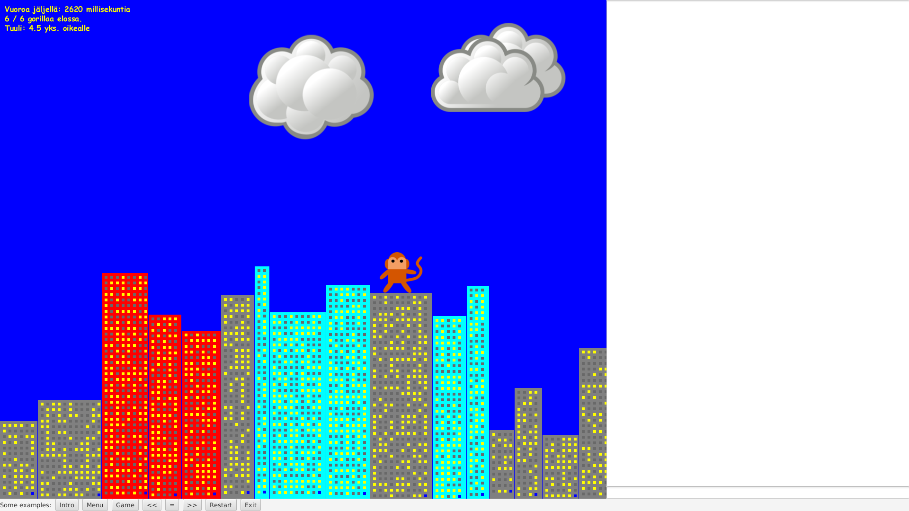

# Assignment
This README contains only general instructions on how to run the game. The development setup, assignment, program structure and hints for completing the assignment can be found in [doc/index.md](doc/index.md) (in Finnish).

# Project description
A game where a bunch of gorillas try to kill each other by throwing bananas on time-limited turns. Last survivor is the winner.

Requires Java 11 or later. Compatible with
Eclipse, IntelliJ IDEA and VS Code with Java Extension Pack. Minor issues with Netbeans.

## Installation

Maven:

```bash
$ git clone https://gitlab.utu.fi/tech/education/distributed-systems/distributed-gorilla

$ cd distributed-gorilla

$ mvn compile package exec:java
```

SBT:

```bash
$ git clone https://gitlab.utu.fi/tech/education/distributed-systems/distributed-gorilla

$ cd distributed-gorilla

$ sbt compile run
```

## JavaFX bugs

JavaFX has serious memory leaks that might lead to a crash in just seconds.
Use the following JVM parameter to switch to software rendering pipeline that
does not have the leaks
```
-Dprism.order=sw
```

E.g.

```bash
$ java -Dprism.order=sw -jar target/distributed-gorilla-1.0.jar
```

The game will allocate significant amounts of memory. Use the following switch
to restrict the heap size to avoid wasting RAM:

```
-Xmx2000m
```

References:

* https://bugs.openjdk.java.net/browse/JDK-8092801
* https://bugs.openjdk.java.net/browse/JDK-8088396
* https://bugs.openjdk.java.net/browse/JDK-8161997
* https://bugs.openjdk.java.net/browse/JDK-8156051
* https://bugs.openjdk.java.net/browse/JDK-8161914
* https://bugs.openjdk.java.net/browse/JDK-8188094
* https://stackoverflow.com/a/41398214

## Further instructions

  * Java platform: https://gitlab.utu.fi/soft/ftdev/wikis/tutorials/jvm-platform
  * Maven: https://gitlab.utu.fi/soft/ftdev/wikis/tutorials/maven-misc
  * SBT: https://gitlab.utu.fi/soft/ftdev/wikis/tutorials/sbt-misc
  * OOMkit: https://gitlab.utu.fi/tech/education/oom/oomkit

Course related

  * https://gitlab.utu.fi/tech/education/distributed-systems/distributed-chat
  * https://gitlab.utu.fi/tech/education/distributed-systems/distributed-crypto
  * https://gitlab.utu.fi/tech/education/distributed-systems/distributed-classloader

## Screenshots


