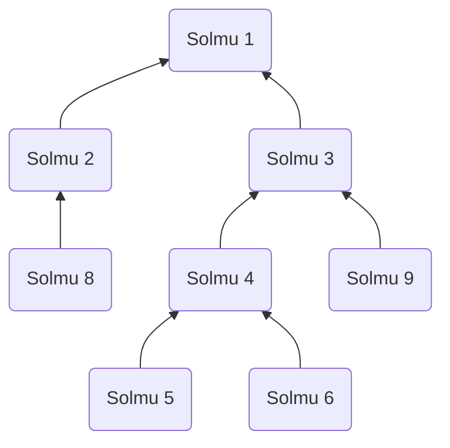

# Mesh-verkko
Mesh-verkon määritelmä tämän työn kontekstissa annetaan tässä dokumentissa. Älä käytä Googlea tai muuta hakukonetta määritelmän tarkentamiseen, sillä tässä esitelty malli on yksinkertaistettu versio verrattuna hakukoneitse löytyviin esimerkkeihin. Mikäli kaipaat tarkennusta johonkin kohtaan, lähetä viestiä kurssiassistenteille ([jastpa@utu.fi](mailto:jastpa@utu.fi) tai [jaanle@utu.fi](mailto:jaanle@utu.fi)) tai kysy harjoitustyöpajoissa.

Mesh-toteutuksen luonnissa ei tulisi käyttää yhtäkään Gorillapelin luokkaa, vaan tarkoitus on toteuttaa geneerinen verkkokerros, joka pystyy välittämään dataa siihen liittyneiden solmujen kesken. Gorillapeli muokataan myöhemmissä vaiheissa käyttämään Mesh-toteutusta. Periaatteessa kehityksen ajaksi Main-luokan `main()`-metodista voi kommentoida graafisen käyttöliittymän käynnistymisen pois päältä ja testata Mesh-toteutusta ilman Gorillapelin käynnistystä. Itse mesh-toteutuksen luokat suositellaan toteuttamaan omassa pakkauksessaan, esimerkiksi fi.utu.tech.distributed.mesh.

## Toimintakuvaus
Mesh-verkko koostuu TCP-sokketteja kommunikaatiossa hyödyntävistä *solmuista* (ts. pelin kontekstissa solmut ovat eri koneilla käynnissä olevia gorillapelejä). Yksittäinen solmu sisältää niin asiakas- kuin palvelinkomponentitkin, joka mahdollistaa solmun niin yhdistävän toiseen solmuun kuin myös kuuntelevan toisten solmujen yhteydenottopyyntöjäkin. Jokainen solmu ottaa yhteyden vain yhteen aiemmin käynnistyneeseen solmuun, mutta yksittäiseen solmuun voivat useat solmut yhdistää. Tämä tekee verkon rakenteesta "puumaisen" (ks. kuva). 


*Graafi eräästä Mesh-verkosta. Nuolet esittävät yhdistämissuuntaa, mutta kommunikaatio on kaksisuuntaista*

Jotta solmu voi ottaa yhteyden muihin mesh-verkon solmuihin, täytyy se yhdistää verkkoon jonkun verkossa olevan solmun kautta. IP-osoite tällaiseen solmuun annetaan käyttäjän toimesta, eli muiden mekanismia solmujen etsimiseen ei tarvitse toteuttaa. Tämän lisäksi solmulle annetaan parametrina portti, johon serverikomponentti asetetaan kuuntelemaan toisten solmujen yhdistämispyyntöjä.

Kun solmut on saatu yhdistettyä TCP-soketeilla toisiinsa, pitäisi viestejä pystyä lähettämään mille tahansa solmulle, joka on verkkoon yhdistänyt. Viestit voi yksinkertaisimmillaan välittää tulvimistekniikalla [(flooding)](https://en.wikipedia.org/wiki/Flooding_(computer_networking)), jolloin siis jokainen solmu vastaanottaessaan viestin, edelleenlähettää sen kaikille naapureillensa (ts. kaikille solmuille, jotka ovat tähän yhdistäneet sekä solmuun, johon tämä itse on yhdistänyt). Tällöin on tärkeää kehittää jokin mekanismi, jolla hillitään kontrolloimatonta viestitulvaa. Eräs tapa on pitää kirjaa, mitkä viestit on vastaanotettu aiemmin, jolloin viestien turha uudelleenlähetys toistamiseen voidaan estää. Tulvimistekniikalla läettäessä voidaan myös yksityisviestit toteuttaa viestiin liitettävän lähetystunnisteen avulla.

## Vaatimukset
- Toteutetaan TCP-socketeilla
- Kaikkien solmujen tulee pystyä vastaanottamaan viestit kaikilta solmuilta
- Yhden solmun tulee tukea useaa tähän yhdistävää solmua säieturvallisesti
- Viesti tulee pystyä kohdistamaan tietylle solmulle
- Solmujen tulee suodattaa duplikaattiviestit sekä heille kuulumattomat viestit vastaanottaessa, eikä paljastaa niitä Mesh-verkkoa käyttävälle ohjelmalle
- Liitosten ei tarvitse olla redudantteja: Tilanteessa, jossa vertainen häviää verkosta, sallitaan, että kaikki tämän vertaisen kautta yhteydessä olevat irtoavat myös Mesh-verkosta
- Mesh-kerroksen tulee luovuttaa vastaanotettu validi, solmulle kuuluva tieto, Mesh-verkkoa käyttävälle ohjelmalle (ts. pelille) säieturvallisesti (Tämä selkenee paremmin 3. aliosiossa)

## Vihjeitä työn implementointiin

### Vinkki 1
Mesh-verkkototeutukseen riittää todennäköisesti 3 luokkaa: Yhteyspyyntöjä odottava ja julkisen APIn tarjoava palvelinluokka/pääluokka, vertaiskommunikaatiosta huolehtiva luokka (voi olla sisäluokka, "inner class") sekä Mesh-viestiluokka, jossa lähetettävä tieto kuljetetaan verkon ylise: sisältää viestin otsaketiedot, sekä itse hyötykuorman.

### Vinkki 2
Vertaisten ei tarvitse olla erityisen älykkäitä viestien edelleenvälityksessä. Toisin sanoen, vastaanotetun viestin riittää lähettää eteenpäin kaikille naapureille, mikäli se on vastaanotettu ensimmäistä kertaa. On vastaanottajan vastuulla hylätä viesti, joka on jo nähty tai muuten kelvoton.

### Vinkki 3
Mesh-verkkototeutuksen pääluokka voisi näyttää seuraavalle:

```java
public class Mesh {
    /**
     * Luo Mesh-palvelininstanssi
     * @param port Portti, jossa uusien vertaisten liittymispyyntöjä kuunnellaan
     */
    public Mesh(int port);
  
    /**
     *  Käynnistä uusien vertaisten kuuntelusäie
     */
    public void run();

    /**
     * Lähetä hyötykuorma kaikille vastaanottajille
     * @param o Lähetettävä hyötykuorma
     */
    public void broadcast(Serializable o);

    /**
     * Lähetä hyötykuorma valitulle vertaiselle
     * @param o Lähetettävä hyötykuorma
     * @param recipient Vastaanottavan vertaisen tunnus
     */
    public void send(Serializable o, long recipient);

    /**
     * Sulje mesh-palvelin ja kaikki sen yhteydet 
     */
    public void close();

    /**
     * Lisää token, eli "viestitunniste"
     * Käytännössä merkkaa viestin tällä tunnisteella luetuksi
     * Määreenä private, koska tätä käyttävä luokka on sisäluokka (inner class)
     * Jos et käytä sisäluokkaa, pitää olla public
     * @param token Viestitunniste 
     */
    private void addToken(long token);

    /**
     * Tarkista, onko viestitunniste jo olemassa
     * Määreenä private, koska tätä käyttävä luokka on sisäluokka (inner class)
     * Jos et käytä sisäluokkaa, pitää olla public
     * @param token Viestitunniste 
     */
    private boolean tokenExists(long token);

    /**
     * Yhdistä tämä vertainen olemassaolevaan Mesh-verkkoon
     * @param addr Solmun ip-osoite, johon yhdistetään
     * @param port Portti, jota vastapuolinen solmu kuuntelee
     */
    public void connect(InetAddress addr, int port);
}
```

### Vinkki 4
Mikäli alkuun pääseminen tuntuu haastavalta, aloita kopioimalla vinkin 3 luokkarakenne `Mesh.java` -tiedostoon ja toteuta luokka siihen asti, että pysyt `run()`-metodissa kuuntelemaan uusia yhteyspyyntöjä.

Kuuntelijasäikeen lisäksi tarvitset luokan, jonka oliot kommunikoivat yhdistäneen asiakkaan kanssa. Ensialkuun riittää, että luot esimerkiksi `Handler`-nimisen luokan, jonka toteutat siihen asti, että se pystyy lukemaan socketeista olioita (kuten String) ja tulostamaan ne näytölle. Samaiseen luokkaan voit luoda myös send(String str) -metodin, joka puolestaan lähettäisi olioita socketin kautta.

Vastaavat rakenteet löytyvät edelleen [distributed-chat -keskustelusovellusta](https://gitlab.utu.fi/tech/education/distributed-systems/distributed-chat) sekä [example-sockets-sivuilta](https://gitlab.utu.fi/tech/education/distributed-systems/example-sockets), josta voit ottaa mallia.

### Vinkki 5
Voit yhdistää omaan koneeseesi ottamalla yhteyttä ns. loopback-osoitteeseen 127.0.0.1, "localhost"

